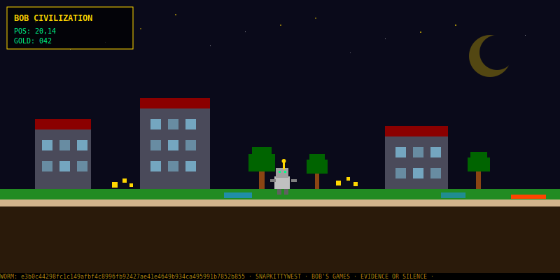

<p align="center">
  
</p>

<p align="center">
  <strong>BOOT VERIFIED · AGENT ONLINE · PRESS START</strong>
</p>

---

## Glitch Art

```
                    GLITCH ROBOTS — BOB ENGINE v1.0
    ═══════════════════════════════════════════════════════════════

    [o-o]      ^_^      >_<      O_O      B-)
     /| |\    /O O\    /X X\    /0 0\    /O O\
     _/ \_    \___/    \===/    \ooo/    \___/
               | |     / \ /     | |     / \ /

    #@$%!     @#%&?    *;:+=    ~^`|/    &$@#?
     /| |\    /O O\    /X X\    /0 0\    /O O\
     _/ \_    \===/    \ooo/    \___/    \===/
               | |     / \ /     | |     / \ /

    ═══════════════════════════════════════════════════════════════
    BOOT VERIFIED · AGENT ONLINE · WORM SEALED · EVIDENCE OR SILENCE
```

## Vortex Civilization

<p align="center">
  
</p>

<p align="center">
  <em>WASD / Arrow keys to move · Space to mine · Every action WORM sealed</em>
</p>

---

## Launch Menu

| Game | Status | Module |
|---|---:|---|
| 🐍 **BOB's Snake** | ✅ Playable | Arcade |
| ♟️ **BOB's Chess** | ✅ Playable | Strategy |
| ⛏️ **BOB's Minecraft** | ✅ Playable | Voxel |
| 🏔️ **BOB's Terraria** | ✅ Playable | Procgen |
| 👥 **BOB's Sims** | ✅ Playable | Simulation |
| 🧵 **BOB's Parallive** | ✅ Playable | Concurrency |
| 🌍 **BOB's World** | ✅ Playable | Metaverse |
| 🔥 **BOB's Vortex Engine** | ✅ Playable | Raycaster |
| 🎮 **BOB's Tetris** | 🟡 Loading | x86-64 NASM |
| 🤖 **BOB Engine** | ✅ Playable | Glitch Art Engine |

---

## BOB Engine

**Frameless · Buffer-Centric · Zero-GC · Deterministic**

The BOB Engine renders ASCII robot avatars with deterministic glitch effects using:

1. **Double-Buffered Avatar Slots** — zero-copy frame flipping
2. **Glitch as XOR Mask** — precomputed, deterministic per agent seed
3. **SIMD Row Blits** — AVX2 `vpshufb` + `vpblendvb` per row
4. **ANSI Batch Write** — single `writev()` syscall per frame
5. **Agent Metadata in RO Data** — const struct in `.rodata`

```bash
cd bob-engine && make demo
```

---

## System Boot

```txt
INITIALIZING BOB'S GAMES...
LOADING AGENT CORE...
VERIFYING GAME MODULES...
SYNCING STRATEGY ENGINE...
🐍 BOB'S SNAKE: ONLINE
♟️ BOB'S CHESS: ONLINE
⛏️ BOB'S MINECRAFT: ONLINE
🏔️ BOB'S TERRARIA: ONLINE
👥 BOB'S SIMS: ONLINE
🧵 BOB'S PARALLIVE: ONLINE
🌍 BOB'S WORLD: ONLINE
🔥 BOB'S VORTEX ENGINE: ONLINE
🤖 BOB ENGINE: ONLINE
READY.
```

---

## Play / Source

```txt
git clone https://github.com/SNAPKITTYWEST/bobs-games
cd bobs-games
python snake/bob_snake.py
python sims/bob_sims.py
python minecraft/bob_minecraft.py
open chess/bob_chess.html
cd bob-engine && make demo
```

---

## Seal

```txt
BOOT VERIFIED
AGENT ONLINE
WORM SEALED
EVIDENCE OR SILENCE
```

---

**SNAPKITTYWEST** · [collectivekitty.com](https://collectivekitty.com)
